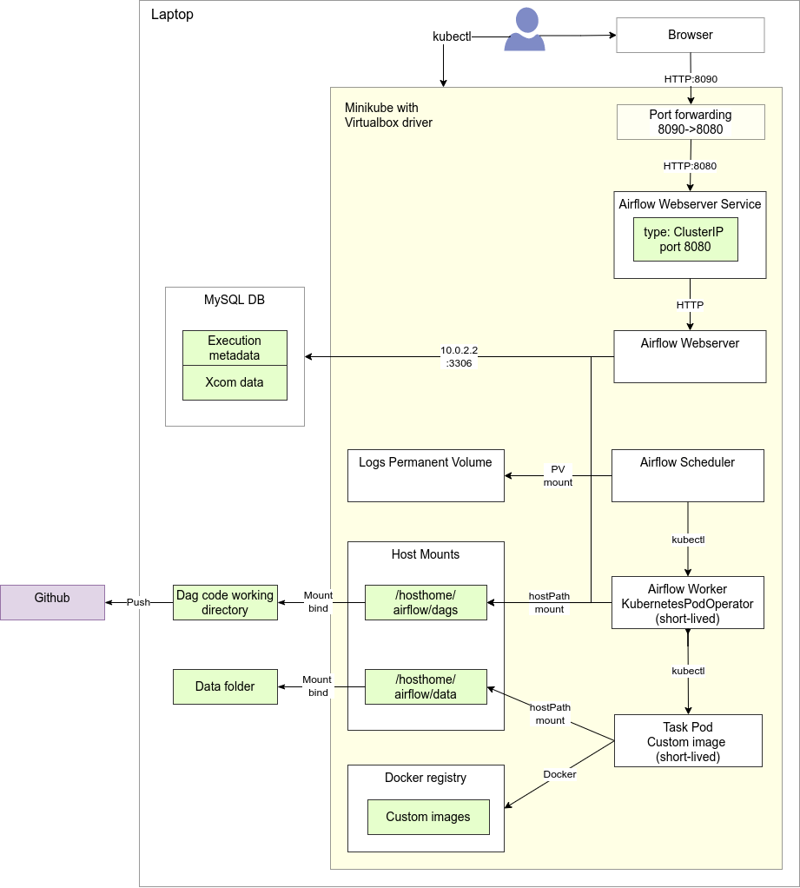

= Airflow on Minikube and GKE
:author: Eric Jacolin
:email: eric@jacolin.net
:revnumber:
:revdate:
:revremark:
:version-label!:
:sectnums:
:toc:
:toclevels: 3
ifndef::env-github[]
:source-highlighter: highlightjs
:highlightjsdir: ../github/highlight
endif::[]

== Purpose

A working infrastructure installation of Apache Airflow on Minikube (locally) and GKE.

The key objective is to have local code (Dags, Tasks, Kubernetes objects) as similar as possible
to that running in GKE.

We assume that we will run Airflow in GKE (Composer) in Kubernetes executor mode, using
exclusively the KubernetesPodOperator. Therefore we do the same in the local Minikube environment.

== TODO

* Test task reading/ writing into a DB, create airflow-test DB
* Deploy to GKE
* Publish on Github
* Papermill working example

== Local Minikube environment

=== Prerequisites

* A working Minikube installation with a Virtualbox VM back-end - https://minikube.sigs.k8s.io/docs/start/[See]
* Provide ample resources, we suggest 6 vCPU and 8GB of RAM:
`minikube start --driver=virtualbox --cpus 6 --memory 8192`
* Helm (v3) installed on host - https://helm.sh/docs/intro/install/[See]
* A DB server running on host (PostgreSQL or MySQL). The host is seen as `10.0.2.2` from within the Minikube cluster.

=== Architecture

The Airflow containers (Webserver, Scheduler, Worker) all:

* Mount the Dags volumes as hostPath mounts (read-only)
* Mount the Logs permanent volume (write)
* Connect to the Airflow DB (write)

The Task execution containers:

* Mount the Dags folder, where we store the Python task executables (read-only)
* Mount the Data volume, for file input/output
* Executes a Python script

https://github.com/apache/airflow/blob/v1-10-stable/airflow/contrib/operators/kubernetes_pod_operator.py[ KubernetesPodOperator task parameters]

== Data persistence

Airflow persists data for DAGs, logs and data. The setup will differ in a local and in a cloud environments.
Here we describe how we manage persistent data in the local Minikube context.

=== DAGs

We mount bind the local airflow folder to the Minikube VM:

`sudo mount --bind /opt/data/projects /home/projects`.

The Airflow project folder `/opt/data/projects/airflow-gke` is viewable from within the Minikube VM
node as `/hosthome/projects/airflow-gke`, and will be used to make the git working directory where
DAGs and task code immediately available to the Airflow execution environment in read-only mode.

When you execute a DAG, the code in the project working directory is used. Airflow does not cache DAGs.

In a cloud environment the DAG code will typically be pulled from a git repo.

=== Data

Convention: Each project (e.g. `example1`) has its own data directory `data/{{project}}`.
Worker pods mount this data directory to read and write data files.

We mount bind a data folder to the Minikube VM:
`sudo mount --bind /opt/data/storage-buckets/airflow /home/storage-buckets/airflow`.

To ensure that the same code runs locally and on GKE to read/write files, we use the Python `fs-gcsfs`
file system abstraction library:

* Locally the file system driver will be 'local file system'
* In a cloud environment the file system driver will be cloud object storage, such as GCP Cloud Storage.

=== Logs

This is the output of Workers, includes boilerplate Worker container logging and application-specific
logging (such as the output of the `return` statement of a task function).

Log persistence require a Kubernetes Persistent Volume and Claim. They can't be hostPath mounts.
The PV is shared (read-only) by Airflow and Workers.

Using a home mounted folder such as `/hosthome/airflow/logs` doesn't work. Containers don't get
write permission on such folder as they're mounted onto a PV, so we must use a "native" Minikube
host folder, such as `/data/airflow-logs`.

Anyway these logs are best viewed from the Airflow UI, associated to each task execution. So it
doesn't matter much that we can't access them from the host file system.

.In the local shell:
[source,bash]
----
# Create the VM node mount point:
minikube ssh
sudo mkdir /data/airflow-logs
sudo chown 50000 airflow-logs
sudo chmod 0777 airflow-logs
# Exit SSH
# Create airflow nmespace if not exists
kubectl create namespace airflow
# Create the Logs PV
kubectl apply -f k8s/log-pv.yml
----

In a cloud environment logs will typically be handled by a Kubernetes managed service.

== Deploying Airflow

=== Secrets

To generate a Fernet key:

`python -c "from cryptography import Fernet; print(Fernet.generate_key().decode())"`

e.g.: `kkEDrWqDYFuMlJiMBUHdmXbWBQ1fmFwrEPWBDAUikpc=`

This key is used by Helm to:

* Create a Kubernetes secret `airflow-fernet-key`
* To mount this secret on all Airflow containers

To generate a Kubernetes secret:

.In the local shell:
[source,bash]
----
# Create the VM node mount point:
kubectl apply -f k8s/secrets.example1.local.yml
----

=== Kubernetes deployments

We deploy the official https://airflow.apache.org/docs/helm-chart/stable/index.html[Helm chart]

.In the local shell:
[source,bash]
----
# Add repo
helm repo add apache-airflow https://airflow.apache.org
# Configurations available
helm show values apache-airflow/airflow > airflow/values.DIST.yaml
# Deploy the Helm chart
helm upgrade -f airflow/values.yaml --install airflow apache-airflow/airflow -n airflow --create-namespace --debug
# Port forwarding for the Web UI (default port 8080 on host is already in use, so using 8090 instead)
kubectl port-forward svc/airflow-webserver 8090:8080 -n airflow
# Launch UI:
minikube service airflow-webserver -n airflow
----

You can log into the Web UI using admin:admin

To change in configuration in `values.yaml`, run the helm chart again and restart the port forwarding as above.

== Worker Docker images

We create a library of predefined Docker image types under folder `images`, eg `pandas-basic`.
These images create predefined Miniconda environments with suitable libraries for generic purposes,
such as:

* Pandas dataframe transformation for ETLs
* Tensorflow model training
* Geopandas GIS dataframe transformation
* etc.

Add additional dependencies to an image's `environment.yml` as needed and rebuild the image.

To build a new version of an image:

.In the local shell:
[source,bash]
----
eval $(minikube docker-env)
export TAG="0.0.1"
docker build -t "pandas-basic:${TAG}" images/pandas-basic
----

Images can be slow to build due to conda package resolution. The trick is to specify package semantic
versions such as `- pandas=1.4` instead of just `- pandas`. This is good practice anyway to ensure
maximum environment reproducibility.

Miniconda is handy because one would typically develop tasks' Python code in Jupyter notebooks, which
use conda packaging and environment management.

Dockerhub native Python images can be used instead of Miniconda.

== Dag and Task design

=== Environment variables

There are two ways to pass environment variables to Worker pods:

1. Using the `env_vars` argument to the KubernetesPodOperator. This in turn creates
environment variables in the execution pod
2. Using Kubernetes ConfigMaps, which create environment variables. Probably the better option in
most cases

.In the local shell:
[source,bash]
----
kubectl apply -f k8s/configmap.example1.local.yml
----

=== Helper functions

To make the DAG code simpler and shorter we created helper functions in a Python package
`dags/common/utils` to generate:

* Volume mounts (DAGs and data)
* ConfigMaps mounts to environment variables
* Secrets mounts to environment variables

These helper functions rely on the following naming conventions:

* Each project has zero or one configmap; the configmap's name should be the project name (e.g. `example1`)
* Each project has zero or one secret; the secret's name should be the project name (e.g. `example1`)

== References

=== Airflow

https://airflow.apache.org/docs/apache-airflow/stable/templates-ref.html[Templates reference]

https://airflow.apache.org/docs/apache-airflow-providers-cncf-kubernetes/stable/operators.html#how-to-use-cluster-configmaps-secrets-and-volumes-with-pod[How to use cluster ConfigMaps, Secrets, and Volumes with Pod?]

https://www.astronomer.io/guides/airflow-sql-tutorial[Using Airflow to Execute SQL]

https://towardsdatascience.com/a-journey-to-airflow-on-kubernetes-472df467f556

https://medium.com/@ipeluffo/running-apache-airflow-locally-on-kubernetes-minikube-31f308e3247a

https://airflow.apache.org/docs/helm-chart/stable/manage-logs.html#externally-provisioned-pvc

https://airflow.apache.org/docs/helm-chart/stable/parameters-ref.html#workers

https://medium.com/bluecore-engineering/were-all-using-airflow-wrong-and-how-to-fix-it-a56f14cb0753

https://www.astronomer.io/blog/10-airflow-best-practices

https://github.com/astronomer/airflow-chart

https://docs.astronomer.io/enterprise/kubepodoperator/

https://registry.astronomer.io/dags/?page=1[DAG examples]

https://registry.astronomer.io/dags/example-kubernetes[DAG KubernetesPodOPerator example]

https://www.astronomer.io/guides/

https://github.com/apache/airflow/blob/v1-10-stable/airflow/contrib/operators/kubernetes_pod_operator.py[Kubernetes Pod Operator API]

https://airflow.apache.org/docs/apache-airflow-providers-cncf-kubernetes/stable/operators.html#how-does-xcom-work[How does Xcom work?]

https://medium.com/datareply/airflow-lesser-known-tips-tricks-and-best-practises-cf4d4a90f8f

=== Papermill

https://papermill.readthedocs.io/en/latest/usage-cli.html

https://stackoverflow.com/questions/68828259/docker-airflow-run-papermill-from-a-different-container

https://stackoverflow.com/questions/68828259/docker-airflow-run-papermill-from-a-different-container
